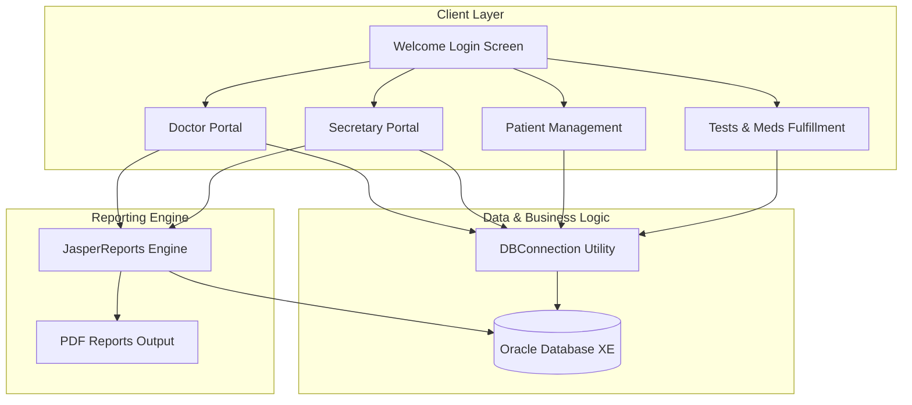

# Hospital Clinic Management System

A desktop application for healthcare administration, patient management, diagnostic ordering, and automated reporting. This project was developed based on field research and requirement gathering conducted at an operating hospital to reflect realistic clinical workflows, role permissions, and database relational structures.

The system is built using Java 17, Java Swing UI, Oracle Database XE, and JasperReports for dynamic PDF document generation.

---

## Architecture Overview



---

## System Modules & Features

### 1. Doctor Portal (`ForDoctor.java`)
* **Patient Queue Inspection**: Real-time listing of unassigned patient visits awaiting clinical evaluation.
* **ICD-10 Diagnosis Search**: Look up international standard diagnosis codes (ICD-10) by keyword and attach diagnoses to visit records.
* **Medical History Review**: Access past visit records, historical ICD-10 diagnoses, lab results, radiology scans, and prescribed medications for any patient.
* **Diagnostic & Prescription Orders**: Order laboratory tests, radiology scans, and pharmaceutical prescriptions linked to active visits.
* **Clinical Report Generation**: Export formatted PDF visit summaries via JasperReports.

### 2. Secretary Portal (`ForSecretary.java`)
* **Appointment Scheduling**: Schedule patient appointments with specific doctors based on date, time slots, and doctor availability.
* **Visit Administration**: Monitor daily visit logs, view doctor-patient assignments, and clear completed visit records.
* **Billing & Administrative View**: Retrieve consolidated visit listings via the relational `jtxtareafill` database view.

### 3. Patient Management (`AddPatient.java`)
* **Patient Registration**: Register new patients with automated incremental primary key generation (`p_id`).
* **Demographic & Contact Records**: Store patient contact details, birth date, gender, address, and insurance info.
* **Record Maintenance**: Search, modify existing patient details, or safely remove records.

### 4. Tests & Medications (`TestsAndMeds.java`)
* **Catalog Management**: Maintain active catalogs of laboratory tests, radiology procedures, and medications.
* **Order Fulfillment**: Fulfill medical requests linked to visit IDs.

### 5. PDF Reporting Engine (`pastMonthVisits.jrxml`)
* Dynamic reporting module powered by JasperReports.
* Generates compiled PDF documents (`VisitSummary.pdf`, `PMvisitreport.pdf`, `EmployeeReport.pdf`) querying visit frequency, doctor performance, and monthly diagnostic statistics.

---

## Database Relational Model

The database schema is designed for Oracle Database and structured into normalized entities:

* **`PATIENT`**: Primary patient demographic information.
* **`DOCTOR`**: Doctor details, contact numbers, and specializations.
* **`ICD_10`**: International Classification of Diseases 10th Revision diagnosis codes.
* **`VISIT`**: Core entity linking patients, doctors, diagnosis codes, and timestamps.
* **`LAB_TEST` & `LAB_ORDER`**: Laboratory procedure catalog and visit test orders.
* **`RAD_TEST` & `RAD_ORDER`**: Radiology procedure catalog and imaging orders.
* **`DRUG` & `DRUG_ORDER`**: Pharmaceutical catalog and prescription records.
* **`jtxtareafill`**: Relational view combining visits, patients, and doctors for quick desktop list rendering.

Refer to [schema.sql](schema.sql) for table definitions, foreign key constraints, and initial seed data.

---

## Technology Stack

* **Programming Language**: Java 17
* **User Interface**: Java Swing (NetBeans GUI Builder)
* **Build Tool**: Apache Maven
* **Database Driver**: Oracle JDBC Driver (`ojdbc8` v21.8.0.0)
* **Reporting Framework**: JasperReports 6.20.3 & iText 2.1.7

---

## Getting Started

### Prerequisites
* **Java Development Kit (JDK)**: Version 17 or higher
* **Apache Maven**: Version 3.8 or higher
* **Oracle Database**: Oracle Database XE (Express Edition) or Docker container running Oracle DB

### 1. Database Setup
1. Connect to your Oracle Database instance using SQL*Plus, SQL Developer, or DBeaver.
2. Run the included DDL and seed script:
   ```sql
   @schema.sql
   ```

### 2. Configuration
Create or modify `src/main/resources/db.properties` with your local Oracle Database connection details:
```properties
db.url=jdbc:oracle:thin:@localhost:1522:XE
db.user=SYSTEM
db.password=YOUR_ORACLE_PASSWORD
```

### 3. Build & Run
Compile the application using Maven:
```bash
mvn clean compile
```

Run the application:
```bash
mvn exec:java
```

---

## License

Distributed under the MIT License. See `LICENSE` for details.
